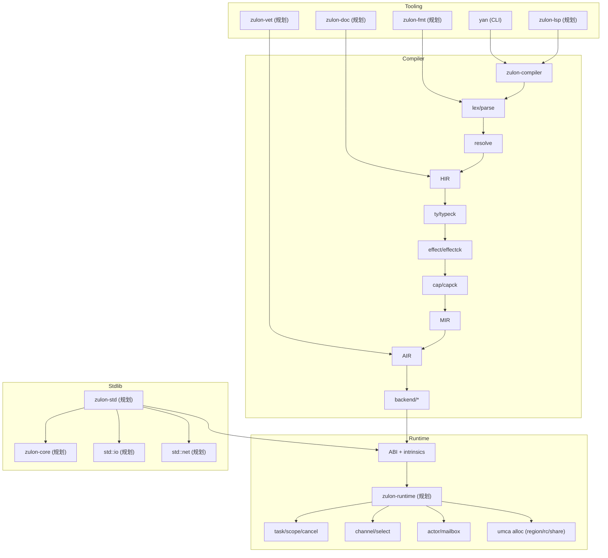
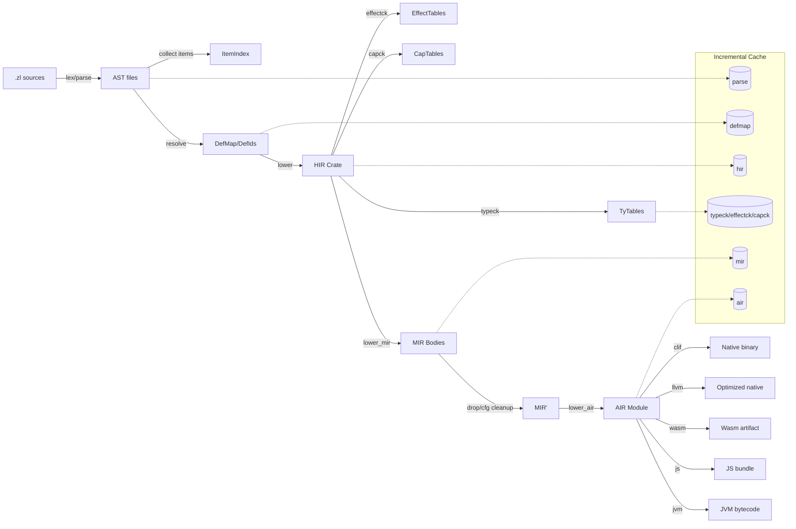
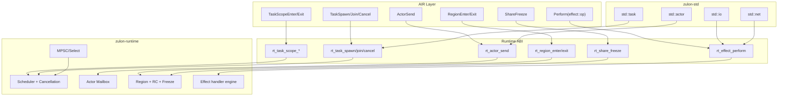

# ZULON 技术方案（Technical Plan）

**版本**: 0.1  
**日期**: 2026-01-05  
**依据**: [docs/ZULON_LANGUAGE_INTEGRATED_DESIGN.md](docs/ZULON_LANGUAGE_INTEGRATED_DESIGN.md) v2.2  

> 目标：把 v2.2 设计规范拆解为可落地的工程方案，覆盖技术选型、模块边界、关键数据结构、验收口径、风险与里程碑。

---

## 0. 总体原则与约束

- **P0 优先可交付**：先做可运行、可测、可扩展的内核；高级特性后移。
- **语义不分叉**：多目标后端共享同一前端语义与 AIR；差异下沉到 lowering。
- **默认安全**：空安全、内存安全、并发边界能力（`Send/Sync/Share`）必须在 P0 就可验证。
- **工程可观测**：从 Day-1 有稳定错误码、可复现测试、基准 JSON 输出。

---

## 1. 交付物清单（按 P0/P1/P2）

### 1.1 P0 交付物（最小可用内核）

- 编译器：
  - Parser/AST/HIR（含降糖）
  - 类型检查（空安全、`T ! E`、ADT+match 完备性）
  - 能力/所有权检查（`owned/local/shared` + `Send/Sync/Share`）
  - effect 推导（effects set）+ handler lowering（受限形态）
  - MIR（显式 CFG + drop 点）与 AIR（能力化 IR）
  - Native 后端（优先 Cranelift JIT/AOT；LLVM 可选）
- 运行时（P0）：
  - task 调度（M:N，work-stealing）
  - `task::scope/spawn/await/cancel` 语义
  - `spawn_detached` + handle 生命周期检查（lint）
  - channel（bounded/unbounded）与 select（最小版）
  - actor mailbox（最小版）
- 内存（P0）：
  - L1（栈）
  - L2（region bump allocator）
  - L3（RC + 深度冻结 `share(x)`）
- 工具链（P0）：
  - `yan build/run/test/bench/vet/fmt/doc` 的最小闭环
  - 增量编译骨架（query-based）

### 1.2 P1 交付物（工程化与精度）

- 更强的增量编译与缓存、LSP 完善
- 更强的诊断与学习模式（规则解释 + 修复建议）
- 不可变持久化集合（shared 友好），allocator 注入增强
- `yan vet` 扩展：unsafe 审计策略、panic 逃逸、dynamic 扩散（若启用）

### 1.3 P2+ 交付物（扩展能力）

- L4 `managed`（可选 GC）与 wasm-gc/组件模型对接策略
- 张量/融合/自动微分与 GPU lowering（如果要做）
- 更强效应多态（行多态/关联效应）
- 更精细借用分析框架（Polonius 路线）

---

## 2. 技术选型（核心决策）

### 2.1 实现语言

- **Rust（建议）**
  - 优点：类型系统强、生态成熟、适合写编译器/运行时；可安全封装底层并发与内存。
  - 与设计一致：ZULON 本身强调“默认安全”，用 Rust 实现编译器更易把 bug 控制在边界。

备选：
- C++：性能/生态强，但工程安全成本更高。

### 2.2 IR 与编译框架

- **自建分层 IR（HIR/MIR/AIR）+ 轻量 query 系统（建议）**
  - 理由：设计规范明确要多目标，AIR 需要表达 region/share/task/actor/effect 等“能力边界”。
  - 选型：
    - HIR：保留类型与 effect 信息、语义就地检查。
    - MIR：CFG + 显式 drop + borrow/cap 约束点。
    - AIR：后端无关的能力化 IR（把 concurrency/memory/effect 边界显式化）。

- **MLIR（P2+ 可选）**
  - 适用：张量/并行/向量化/多层 dialect 的工程路线。
  - 风险：引入成本高，P0 不建议上。

### 2.3 Native 代码生成

- **Cranelift（P0 优先）**
  - 理由：集成简单、编译速度快；适合 P0 快速跑通 AOT/JIT 与调试。
  - 产物：可先支持 AOT（release）与 debug 输出；JIT 用于脚本入口或 REPL（若做）。

- **LLVM（P1/P2 可选）**
  - 理由：极致优化与平台覆盖强。
  - 策略：不阻塞 P0；将 AIR→LLVM lowering 作为后续扩展。

### 2.4 Wasm/JS/JVM 后端

- P0 仅要求“IR 分层与接口稳定”；后端可先做一个。
- 推荐顺序：
  1) Native（P0）
  2) Wasm32-wasi（P1）
  3) JS（P1/P2）
  4) JVM（P2）
  5) Rust 源码输出（P2）

### 2.5 Parser 与语法

- 选型：
  - Rust 生态：`rowan`/`logos`/`pest`/`lalrpop`/手写 Pratt parser。
- 建议：
  - **手写 Pratt + 递归下降**：语法演进期更灵活；错误恢复可控。
  - token 流 + 绿色树（可选）：为 LSP 与增量解析铺路。

### 2.6 运行时并发

- 选型：
  - **自研轻量 runtime（建议）**：只实现 P0 所需 task/scope/cancel/channel/actor。
  - I/O reactor：P1 再做（Linux io_uring 优先）。
- 说明：tokio 等成熟 runtime 可以借鉴，但直接依赖会把语义“外包”给第三方，不利于 effect/取消/诊断一体化。

---

## 3. 编译器架构（模块拆分）

### 3.1 Frontend

- `lexer`：token + span
- `parser`：AST（包含错误恢复）
- `resolver`：名称解析、可见性图、模块系统
- `desugar`：
  - `?`、`try`、`task::scope` 语法糖
  - async 状态机（若 P0 需要 async）

### 3.2 Typeck（类型系统）

P0 必须覆盖：
- 空安全：`T` vs `T?`；`?.`、`??`
- `T ! E` 与错误联合 `E1 | E2`
- ADT + match 完备性检查
- trait/where（可先做最小 subset：单态化泛型 + trait bound）

关键数据结构建议：
- `TyId`/`TyKind`（interning）
- `EffectSet`（bitset 或 small-set + canonicalization）
- `ErrorUnion`（归一化 + 子类型判定：`E ⊆ E'`）

### 3.3 Capck（能力/所有权/并发边界检查）

P0 目标：
- 计算每个值的权限视图：`owned/local/shared`
- 计算并发能力：`Send/Sync/Share`
- 边界规则：
  - task/actor 边界 move 需要 `Send`
  - share 需要深度冻结 `Share`
  - region 逃逸禁止（`local` 不可跨作用域）

实现建议：
- MIR 上做 CFG 数据流（NLL 风格）
  - 先 sound，再逐步提升精度
- `share(x)`：
  - 在类型系统上标注“冻结后不可变”
  - 对聚合类型递归检查可冻结性

### 3.4 Effects（推导与 lowering）

P0 建议采取：
- `performs E` 里的 `E` 为 effects set
- effect 调用点 `do X::f(...)` 作为 IR 上的显式指令
- handler lowering：
  - P0 先限制为“浅 handler + resumable”的可实现形态
  - lowering 到状态机/continuation：
    - 正常路径无额外开销（不构造回溯栈）
    - 仅在 perform 点进行最小化上下文切换

### 3.5 IR Pipeline

- AST → HIR：类型占位 + 语义节点
- HIR → MIR：
  - 显式 CFG、显式 drop、region 作用域节点
  - 标注：borrow/cap/effect 边界点
- MIR → AIR：
  - 规范化能力边界（task/actor/region/share/effect）
  - 为后端降低分离差异

### 3.6 HIR/MIR/AIR 工程化接口草案（Compiler-First）

本节给出“可实现的接口轮廓”，目标是：

- 能直接落到 Rust 模块与数据结构；
- 支持 query-based 增量（文件级 → item 级）；
- 让类型/effect/cap 检查都能在稳定的 IR 边界上完成；
- AIR 成为后端唯一语义入口（多目标不分叉）。

#### 3.6.1 工作区与 crate 结构（建议）

建议把编译器拆成独立 crate（后续可 workspace）：

```text
zulon-compiler/
  src/
  diag/          # Diagnostic, ErrorCode, Span, SourceMap
  lex/           # Lexer
  parse/         # Parser + AST (lossy tree, error recovery)
  hir/           # HIR defs/expr/ty/effects (post-resolve)
  resolve/       # Name resolution + module graph
  ty/            # Ty interner, unify, subtyping for ErrorUnion
  effect/        # EffectSet model + inference
  cap/           # Ownership/capability model + checks
  mir/           # MIR CFG + drop + place/rvalue
  air/           # Capability-oriented IR
  backend/       # clif/llvm/wasm lowering
  query/         # incremental db (Salsa-like, minimal)
  driver/        # CLI integration for `yan`
```

#### 3.6.2 共享基础设施：Span/ID/Arena/Interner/Diag

核心约定：所有 IR 节点用“稳定 ID + arena 存储”，通过 `IndexVec`/`Vec` 访问；跨 pass 使用 ID，避免引用生命周期复杂化。

```rust
// diag
pub struct Span { pub file: FileId, pub start: u32, pub end: u32 }
pub struct Diagnostic { pub code: ErrorCode, pub msg: String, pub span: Span }

// ids
#[repr(transparent)] pub struct HirExprId(u32);
#[repr(transparent)] pub struct HirItemId(u32);
#[repr(transparent)] pub struct MirBodyId(u32);
#[repr(transparent)] pub struct AirFuncId(u32);

// intern
#[repr(transparent)] pub struct Symbol(u32); // interned string

// interner-ish
pub struct TyId(u32);
pub struct EffectId(u32);
pub struct DefId(u32); // global definition id after resolve
```

备注：

- `Symbol`、`TyId`、`EffectId` 统一走 interner（hashcons）。
- `DefId` 是跨 crate 的全局句柄（类似 Rust 的 DefId），用于把 HIR 与后续 IR 锚定到“语义定义”。

#### 3.6.3 HIR（High-level IR）数据结构

HIR 的职责：

- 模块/名字已解析（用 `DefId` 指向定义），语法糖已基本展开；
- 保留高层结构（match/adt/trait 调用）以便做类型、effect、能力检查；
- HIR 节点携带 `Span`，方便高质量诊断。

建议最小结构：

```rust
pub struct HirCrate {
  pub items: Vec<HirItem>,
  pub entry: Option<DefId>, // start/main
}

pub enum HirItem {
  Func(HirFunc),
  Type(HirTypeDef),   // ADT/alias
  Trait(HirTrait),
  Impl(HirImpl),
  Const(HirConst),
}

pub struct HirFunc {
  pub def: DefId,
  pub name: Symbol,
  pub generics: HirGenerics,
  pub params: Vec<HirParam>,
  pub ret: HirTy,
  pub throws: Option<HirErrorTy>,   // 对应 `! E`
  pub performs: HirEffectSet,       // 对应 `performs {..}`
  pub body: HirBody,
  pub span: Span,
}

pub struct HirBody {
  pub exprs: Vec<HirExpr>,
  pub root: HirExprId,
}

pub enum HirExpr {
  Lit(HirLit, Span),
  Var(DefId, Span),
  Let { pat: HirPat, init: HirExprId, span: Span },
  Block { stmts: Vec<HirStmt>, tail: Option<HirExprId>, span: Span },
  Call { callee: HirCallee, args: Vec<HirExprId>, span: Span },
  Match { scrut: HirExprId, arms: Vec<HirArm>, span: Span },
  If { cond: HirExprId, then_: HirExprId, else_: Option<HirExprId>, span: Span },

  // 空安全：?. 与 ?? 在 desugar 后可变为显式 match/if，但保留也可。
  Coalesce { lhs: HirExprId, rhs: HirExprId, span: Span }, // `??`

  // 预期错误：`?` 在 desugar 后可变为 match/return，但可保留一层节点
  Try { expr: HirExprId, span: Span },

  // effects
  Do { op: HirEffectOp, args: Vec<HirExprId>, span: Span },
  Handle { body: HirExprId, handlers: Vec<HirHandler>, span: Span },

  // 并发/内存原语（在 HIR 可是库调用，但建议作为“已识别的 intrinsic”标注）
  Intrinsic { kind: HirIntrinsic, args: Vec<HirExprId>, span: Span },
}

pub enum HirStmt {
  Let { pat: HirPat, init: HirExprId, span: Span },
  Expr(HirExprId),
}

pub enum HirPat {
  Wild(Span),
  Bind { name: Symbol, def: DefId, span: Span },
  Variant { adt: DefId, variant: DefId, fields: Vec<HirPat>, span: Span },
}

pub struct HirEffectSet { pub effects: Vec<EffectId> }
pub struct HirErrorTy { pub alts: Vec<TyId> } // 归一化后的错误联合
```

类型表示建议：

```rust
pub enum HirTy {
  Named(DefId, Span),
  App { ctor: DefId, args: Vec<HirTy>, span: Span },
  Nullable(Box<HirTy>, Span), // `T?`
  Result { ok: Box<HirTy>, err: HirErrorTy, span: Span }, // `T ! E`（也可不在 HIR Ty 上显式化）
}
```

关键点：

- `T ! E` 可以作为“函数签名的 throws + Try 节点”建模，也可以落到 `HirTy::Result`，但两者不要同时作为真相来源。
- `ErrorUnion` 做 canonicalization：排序 + 去重 + 约束 `never`/`Bottom`。

#### 3.6.4 MIR（Mid-level IR）数据结构

MIR 的职责：

- 结构化为 CFG，所有求值顺序显式；
- `drop` 点明确；
- 为 cap/borrow/effect lowering 提供稳定载体；
- 便于后端生成 SSA/栈机。

建议采用“Rust MIR 风格”：`Place`/`Rvalue`/`Statement`/`Terminator`。

```rust
pub struct MirBody {
  pub def: DefId,
  pub locals: Vec<MirLocalDecl>,
  pub blocks: Vec<MirBasicBlock>,
  pub start: MirBlockId,
  pub span: Span,
}

pub struct MirLocalDecl {
  pub ty: TyId,
  pub mutability: MirMut,
  pub debug_name: Option<Symbol>,
}

pub struct MirBasicBlock {
  pub stmts: Vec<MirStmt>,
  pub term: MirTerminator,
}

pub enum MirStmt {
  Assign(MirPlace, MirRvalue, Span),
  StorageLive(MirLocalId, Span),
  StorageDead(MirLocalId, Span),
  Drop(MirPlace, Span),

  // 用于把 effect/cap 边界“钉”在 IR 上
  MarkEffectBoundary(MirEffectMark, Span),
  MarkCapBoundary(MirCapMark, Span),
}

pub enum MirTerminator {
  Goto { target: MirBlockId, span: Span },
  Return { span: Span },
  Switch { discr: MirOperand, targets: Vec<(i128, MirBlockId)>, otherwise: MirBlockId, span: Span },
  Call { func: MirOperand, args: Vec<MirOperand>, dest: MirPlace, target: MirBlockId, unwind: Option<MirBlockId>, span: Span },

  // `?` 可在 MIR 中作为显式 terminator（可选）
  Throw { err: MirOperand, span: Span },
}

pub enum MirPlace {
  Local(MirLocalId),
  Field(Box<MirPlace>, u32),
  Deref(Box<MirPlace>),
}

pub enum MirRvalue {
  Use(MirOperand),
  Ref(MirBorrowKind, MirPlace),
  Aggregate(MirAggKind, Vec<MirOperand>),
  BinOp(MirBinOp, MirOperand, MirOperand),
  // …按需增补
}

pub enum MirOperand { Copy(MirPlace), Move(MirPlace), Const(MirConst) }
```

MIR 上建议额外维护：

- `MirSourceInfo`：映射回 HIR/Span
- `MirScopes`：region/lexical scope tree（用于 region 释放与 drop 顺序）
- `MirFacts`（可选）：为 cap/borrow/effect 推导产出的事实表（后续接入更强分析/求解器）

#### 3.6.5 AIR（Ability/Capability IR）数据结构

AIR 的职责：

- 把“并发/内存/effect 的能力边界”显式化成少数几类原语指令；
- 让后端只需实现这些原语的 lowering（native/wasm/js/jvm），语义不再分叉；
- 将 P0 运行时 ABI/调用约定固化。

AIR 建议采取“指令 + 显式控制流”的 IR，重点是 boundary ops：

```rust
pub struct AirModule {
  pub funcs: Vec<AirFunc>,
}

pub struct AirFunc {
  pub id: AirFuncId,
  pub def: DefId,
  pub sig: AirSig,
  pub blocks: Vec<AirBlock>,
}

pub struct AirSig {
  pub params: Vec<AirTy>,
  pub ret: AirTy,
  pub throws: Option<AirErrorTy>,
  pub performs: AirEffectSet,
}

pub enum AirInst {
  // 普通计算
  Call { callee: AirValue, args: Vec<AirValue> },
  Return { value: Option<AirValue> },

  // effect 边界
  Perform { effect: EffectId, op: Symbol, args: Vec<AirValue> },

  // task/actor 边界
  TaskScopeEnter,
  TaskSpawn { func: AirValue, args: Vec<AirValue>, kind: AirSpawnKind },
  TaskJoin { handle: AirValue },
  TaskCancel { handle: AirValue },
  ActorSend { actor: AirValue, msg: AirValue },

  // region / share
  RegionEnter,
  RegionExit,
  ShareFreeze { value: AirValue },
}
```

落地策略：

- AIR 不追求表达所有语法，只表达“可执行语义 + 边界原语”。
- `TaskSpawn/ActorSend/ShareFreeze/Perform` 的 ABI 由 runtime crate 提供。

#### 3.6.6 Pass 顺序（严格定义输入/输出）

建议把 pipeline 固化为一张表（每步都是可缓存 query）：

1) `lex(file) -> TokenStream`  
2) `parse(file) -> AstFile`（带错误恢复）  
3) `collect_items(ast) -> ItemIndex`（收集 item 壳，建立 module graph）  
4) `resolve(ast, index) -> DefMap`（为每个路径/标识符绑定 `DefId`）  
5) `lower_hir(ast, defmap) -> HirCrate`（降糖到 HIR）  
6) `typeck(hir) -> TyTables`（为 expr/item 赋 `TyId`，并产出约束/错误）  
7) `effectck(hir, TyTables) -> EffectTables`（effects set 推导与检查）  
8) `capck(hir, TyTables, EffectTables) -> CapTables`（owned/local/shared + Send/Share + region 逃逸）  
9) `lower_mir(hir, TyTables, EffectTables) -> MirBody`（CFG 化 + 显式求值顺序）  
10) `mir_drop_elab(mir) -> mir'`（补齐 drop、scope、cleanup block）  
11) `mir_cap_borrow(mir', CapTables) -> mir''`（可选：把关键边界点固化/插桩）  
12) `lower_air(mir'') -> AirModule`（把边界原语规范化）  
13) `codegen(air, backend) -> artifact`（clif/llvm/wasm/js/jvm）

说明：

- P0 可以把 10/11 合并进 `lower_mir`，但接口上建议预留独立 pass，避免后续大改。
- 若 `Try/?` 在 HIR 保留，则在 `lower_mir` 阶段统一降到“显式分支 + Throw/Return”。

#### 3.6.7 Query 接口草案（增量编译骨架）

可以做一个 Salsa-like 的最小接口（先文件级）：

```rust
pub trait Db {
  fn source_text(&self, file: FileId) -> Arc<str>;

  fn parse(&self, file: FileId) -> Arc<AstFile>;
  fn defmap(&self, crate_id: CrateId) -> Arc<DefMap>;
  fn hir(&self, crate_id: CrateId) -> Arc<HirCrate>;
  fn typeck(&self, crate_id: CrateId) -> Arc<TyTables>;
  fn effectck(&self, crate_id: CrateId) -> Arc<EffectTables>;
  fn capck(&self, crate_id: CrateId) -> Arc<CapTables>;
  fn mir(&self, def: DefId) -> Arc<MirBody>;
  fn air(&self, crate_id: CrateId) -> Arc<AirModule>;
}
```

后续 item 级增量：把 `hir(typeck/effectck/capck/mir)` 从 crate 粒度拆成 `DefId` 粒度（函数/常量/类型定义）。

#### 3.6.8 最小“可开工”验收点（建议）

- 能从单文件生成 HIR（含 `DefId` 绑定）并做 `null-safety` + `T ! E` 检查。
- 能把一个函数 lowering 到 MIR（带 CFG + drop）并输出可读 dump。
- 能把 `do/handle` 形成 AIR 的 `Perform` 指令（即便 runtime 先用 stub）。
- 能把 `task::scope/spawn` 识别为 AIR 的 `TaskScopeEnter/TaskSpawn`。

### 3.7 整体架构（系统视角）与架构图

本节是“从 repo 到可交付产品”的全景：

- **前端/编译器**：从源码到 AIR，再到各后端产物。
- **运行时/标准库**：为 task、channel、actor、effect handler 等提供 ABI 与实现。
- **工具链**：`yan` 负责构建、测试、基准、审计、文档与格式化的一致入口。

#### 3.7.1 Workspace / 组件划分（建议的最终形态）

说明：当前仓库已经是 workspace，已存在 `zulon-compiler` 与 `zulon-language`（原型/占位二进制）。下图是建议的最终组件分层（未创建的 crate 用“规划”表示）。



#### 3.7.2 编译流水线架构图（Source → HIR → MIR → AIR → Artifact）

这张图强调“数据流 + 缓存边界（query）”，便于增量编译与诊断。



#### 3.7.3 运行时/标准库/ABI 架构图（AIR 原语如何落地）

这张图强调“AIR 指令集”与 runtime/stdlib 的边界：编译器只产出原语调用；语义由 runtime 实现并被 `yan vet` 审计。



#### 3.7.4 关键边界（必须“画清楚”的接口）

- **Compiler ↔ Runtime**：只通过 AIR 原语与 ABI；runtime 不反向侵入类型系统。
- **Std ↔ Runtime**：std 负责 API 与效果建模（IO/NET 等），runtime 负责调度/内存/handler 执行。
- **Tooling ↔ Compiler**：
  - `yan fmt/doc/lsp` 主要依赖 parse/HIR。
  - `yan vet` 依赖 AIR（对 unsafe/cap/effect 边界做审计）。

---

## 4. 运行时方案（P0）

### 4.1 task 与 scope

- 调度：work-stealing + 协作式安全点
- `task::scope`：
  - 创建 scope frame
  - `spawn` 注册为 child
  - scope 退出前 join；`?`/panic 触发取消传播
- 取消：
  - cancellation token 贯穿 child
  - `await`/I/O/循环回边作为检查点

### 4.2 spawn_detached 与泄漏治理

- `spawn_detached` 返回 `TaskHandle`
- `yan vet` 检测：handle 未 `await/detach/cancel` 即 `W-TASK-LEAK`

### 4.3 channel/select

- bounded：环形缓冲 + 背压
- unbounded：链表队列（需限制内存增长策略）
- select：P0 可先用轮询公平；后续可引入随机/优先级

### 4.4 actor

- mailbox：MPSC 队列
- 处理循环：单线程执行，内部可变状态不泄漏引用
- 监督：P0 只做“panic 隔离”；P1 再做重启/熔断策略

---

## 5. 内存方案（UMCA P0）

### 5.1 L1（栈/标量替换）

- 编译器做基础 escape analysis：局部不逃逸尽量栈上分配

### 5.2 L2（region）

- bump allocator：
  - scope 进入创建 arena
  - scope 退出整体释放
- 限制：region 内对象引用不得逃逸

### 5.3 L3（冻结共享 + RC）

- `share(x)`：深度冻结 + 提升为 `shared T`
- RC：
  - 跨边界才引入 RC
  - 编译器做“边界内 RC 消除/合并”（P1 优化项）

### 5.4 L4（managed，P2+）

- 仅脚本模式或显式开启
- wasm-gc 兼容策略作为 P2+ 议题

---

## 6. 工具链（yan）

### 6.1 P0 命令与实现策略

- `yan build`：调用编译器，支持 `--release`、`--target`
- `yan run`：运行 `start` 或 `main`
- `yan test`：最小测试运行器（并发可复现：固定 seed + 调度记录）
- `yan bench`：输出 JSON（基线/回归阈值）
- `yan vet`：静态审计（cap/unsafe/dynamic/panic 等）
- `yan fmt`：格式化（可先用语法树 pretty-printer）
- `yan doc`：从 AST/HIR 提取文档注释

### 6.2 query-based 增量编译

- 每个阶段暴露为 query：parse/resolution/typeck/capck/effectck/lowering
- cache key：语义哈希 + 依赖边
- P0 可先做“文件级增量”，P1 再细粒度到 item 级

---

## 7. 测试、基准与验收

### 7.1 编译器测试

- 语法：golden tests（输入/错误输出快照）
- 类型/能力：定向用例（`E-SEND/E-SHARE/E-REGION-ESCAPE`）
- 差分：P1 引入 fuzz（parser/MIR）

### 7.2 运行时测试

- task::scope：取消传播、panic 隔离、join 语义
- channel/select：公平性、背压、竞争
- actor：不泄漏引用（类型/运行时双重保证）

### 7.3 基准（P0）

- `await` ping-pong ops/s
- channel ping-pong 吞吐 + p99
- actor mailbox 吞吐
- effect perform/resume 开销

---

## 8. 风险与对策

- **语义复杂度过高**：P0 先做最小子集，严格 gate feature。
- **effect lowering 过难**：P0 限制 handler 形态；先用状态机实现，逐步优化。
- **借用/能力检查精度不足**：先 sound（NLL 风格 CFG 数据流），P1/P2 再提升精度。
- **多目标分叉**：坚持 AIR 作为唯一语义载体；后端只做 lowering。
- **运行时不可控**：先做最小 runtime；把 I/O reactor 与高级调度策略留到 P1。

---

## 9. 建议的里程碑（示例）

- M0：lexer/parser + AST + 基础诊断框架（错误码/位置）
- M1：resolver + HIR + 最小 typeck（null-safety + `T ! E` + match 完备）
- M2：MIR + capck（owned/local/shared + Send/Share/region escape）
- M3：effects set 推导 + handler lowering（受限形态）
- M4：AIR + Cranelift native 后端跑通（hello + 简单函数）
- M5：runtime P0（task/scope/channel/actor）+ `yan build/run/test/bench/vet` 闭环

---

## 10. 附：与样例代码的对应

- 全要素样例： [examples/zulon_kitchen_sink.zu](examples/zulon_kitchen_sink.zu)
- P0 最小子集样例： [examples/zulon_p0_minimal.zl](examples/zulon_p0_minimal.zl)
